<div align="center">

# 🌌 Nebula — Architecture Reference

**XMSS Post-Quantum Wallet · SP1 zkVM · Groth16 · Soroban**

</div>

---

## Table of Contents

1. [System Overview](#1-system-overview)
2. [Component Map](#2-component-map)
3. [Transaction Lifecycle](#3-transaction-lifecycle)
4. [XMSS Signing Layer](#4-xmss-signing-layer)
5. [ZK Proof Layer — SP1 Circuit](#5-zk-proof-layer--sp1-circuit)
6. [Cloud Proving — Sindri](#6-cloud-proving--sindri)
7. [Smart Contract — Soroban](#7-smart-contract--soroban)
8. [CLI Orchestration](#8-cli-orchestration)
9. [Browser Extension](#9-browser-extension)
10. [Relay Server](#10-relay-server)
11. [Data Formats](#11-data-formats)
12. [Security Properties](#12-security-properties)
13. [Design Decisions & Trade-offs](#13-design-decisions--trade-offs)

---

## 1. System Overview

Nebula is a **post-quantum smart wallet** on Stellar. The core security guarantee is:

> *"No classical asymmetric cryptography (ECDSA/ed25519) is used in the signing path. All on-chain authentication is via XMSS signatures, verified via a zero-knowledge proof."*

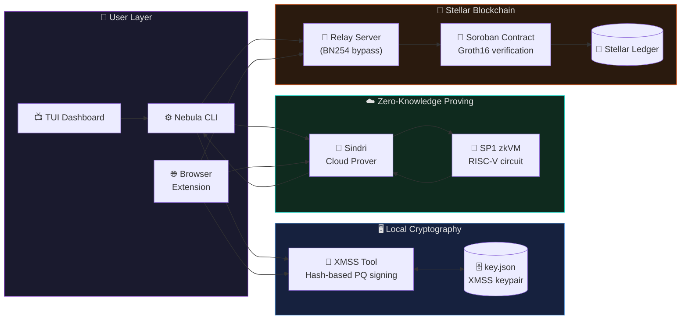

### Threat Model

| Threat | Mitigation |
|--------|-----------|
| Quantum adversary (Shor's algorithm) | XMSS signatures — only SHA-256 internally, not broken by quantum |
| Replay attacks | On-chain wallet nonce, embedded in `tx_bytes` and committed in ZK proof |
| Key leakage during proving | Private key never sent to Sindri; only `proof_inputs.json` leaves device |
| Signature forgery | Groth16 proof binding to `pubkey_hash` — forging requires breaking SHA-256 |
| Contract manipulation | Hardcoded verification key in Soroban contract — immutable post-deploy |

---

## 2. Component Map

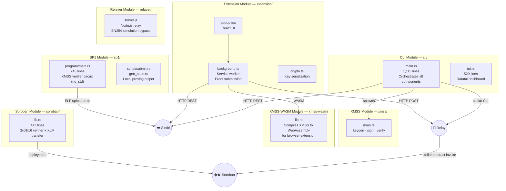

### Component Responsibilities

| Component | Language | Role |
|-----------|----------|------|
| `cli/` | Rust | User-facing command-line interface; orchestrates all other components |
| `xmss/` | Rust | XMSS key generation, signing, local verification |
| `xmss-wasm/` | Rust → WASM | XMSS compiled to WebAssembly for browser |
| `sp1/program/` | Rust (no_std) | zkVM circuit — implements XMSS-SHA2_10_256 verification |
| `sp1/script/` | Rust | Helper scripts for local proving (development) |
| `soroban/` | Rust (no_std) | On-chain smart contract — Groth16 verify + XLM transfer |
| `extension/` | TypeScript + React | Chrome MV3 browser extension |
| `relayer/` | Node.js | Relay server bypassing Stellar testnet BN254 simulation limitation |

---

## 3. Transaction Lifecycle

### 3.1 Key Generation (one-time)

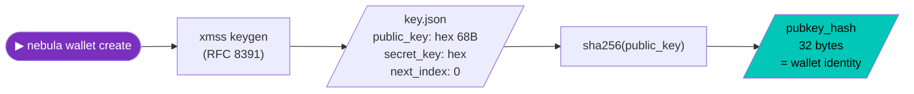

### 3.2 Funding

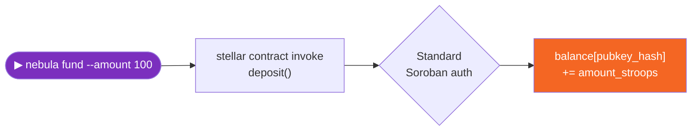

### 3.3 Withdrawal — Full 4-Stage Pipeline

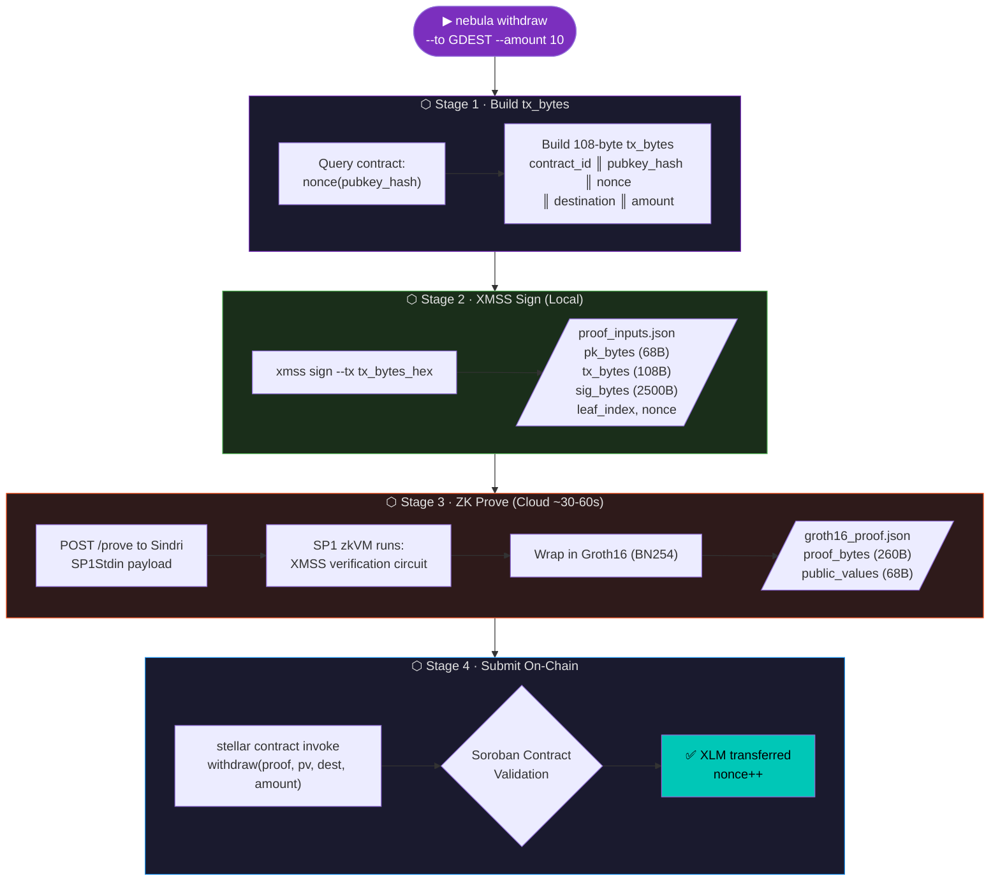

### 3.4 On-Chain Validation (Soroban Contract Logic)

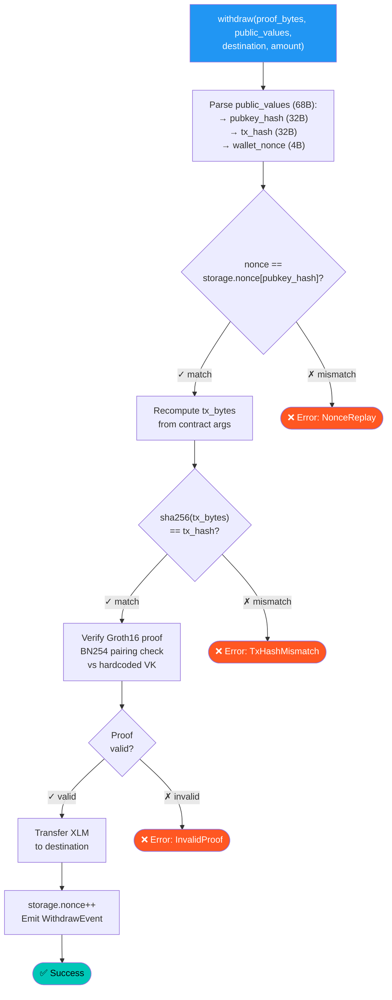

---

## 4. XMSS Signing Layer

### 4.1 Algorithm Overview — XMSS-SHA2_10_256

XMSS (eXtended Merkle Signature Scheme, RFC 8391 / NIST SP 800-208) is a stateful hash-based signature scheme. It builds a Merkle tree of WOTS+ one-time signatures.

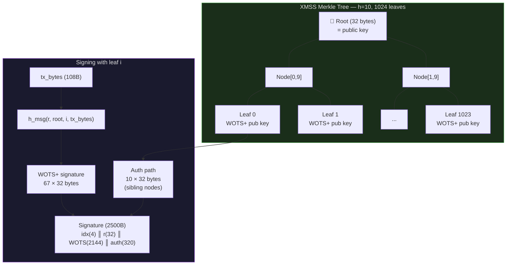

### 4.2 Key & Signature Byte Formats

**Public Key — 68 bytes:**

```
Offset  Size  Content
  0       4   OID (Algorithm identifier)
  4      32   Root node of Merkle tree
 36      32   Public seed (used in WOTS+ hash functions)
```

**Signature — 2500 bytes:**

```
Offset  Size  Content
  0       4   Leaf index (u32 LE) — which one-time key was used
  4      32   r — randomness for h_msg computation
 36    2144   WOTS+ signature (67 chains × 32 bytes each)
2180     320   Authentication path (10 nodes × 32 bytes each)
```

### 4.3 Key State Management

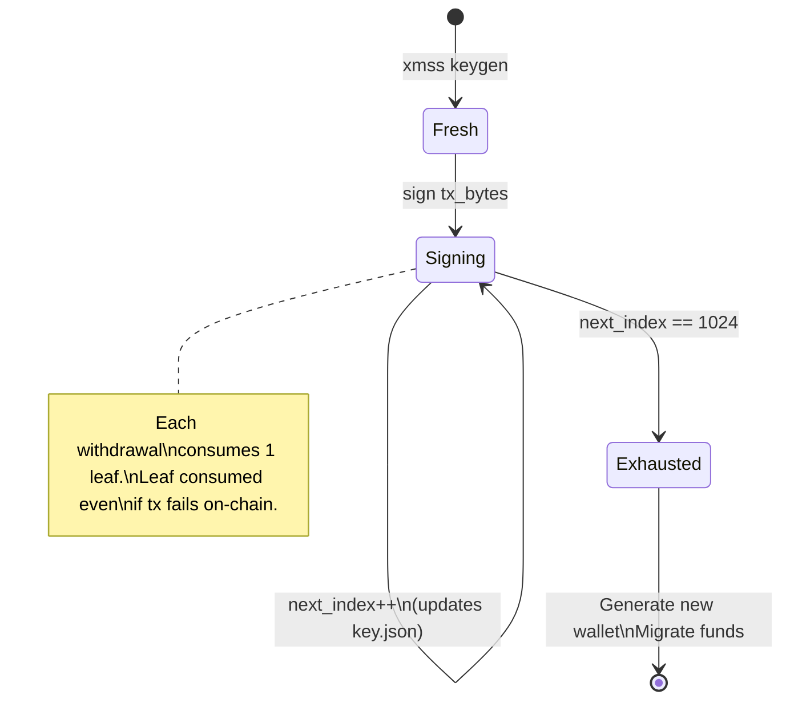

---

## 5. ZK Proof Layer — SP1 Circuit

### 5.1 Circuit Architecture

The SP1 guest program (`sp1/program/src/main.rs`) implements XMSS verification inside a RISC-V zkVM. This means the Groth16 proof mathematically certifies that the circuit executed correctly — i.e., that a valid XMSS signature was verified.

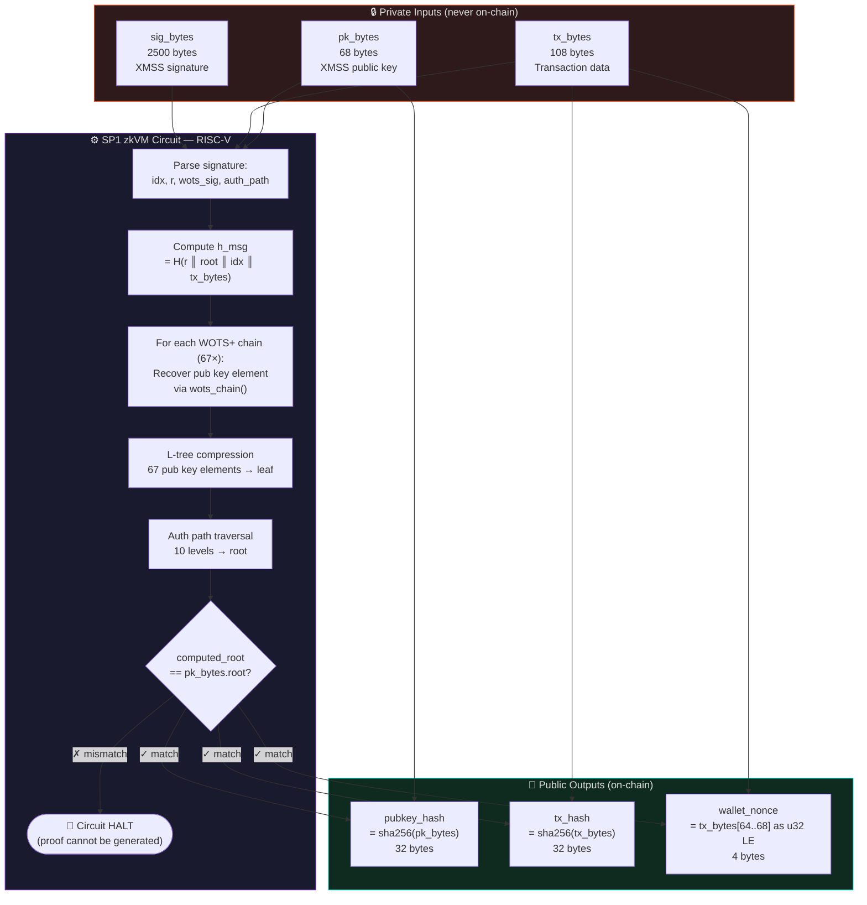

### 5.2 SHA-256 Operation Count

| Operation | SHA-256 calls |
|-----------|-------------|
| `h_msg` computation | ~3 |
| WOTS+ chain (per element, 67 elements) | ~15 avg |
| L-tree compression | ~66 |
| Auth path traversal | 10 |
| **Total (approximate)** | **~1,000–1,200** |

This is why XMSS was chosen over SPHINCS+ (17,000+ calls) or Falcon (FFI/RAM issues). See [`DEVLOG.md`](./DEVLOG.md) for the full story.

---

## 6. Cloud Proving — Sindri

### 6.1 API Flow

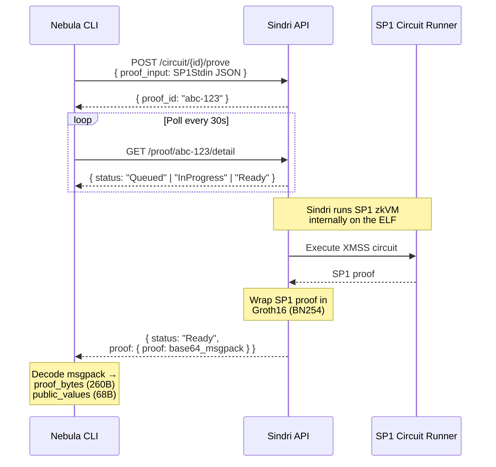

### 6.2 SP1Stdin Encoding

The circuit input must be encoded as `SP1Stdin` (SP1's standard input format):

```json
{
  "buffer": [
    [8-byte LE length prefix] + [pk_bytes (68B)],
    [8-byte LE length prefix] + [tx_bytes (108B)],
    [8-byte LE length prefix] + [sig_bytes (2500B)]
  ],
  "ptr": 0,
  "proofs": []
}
```

Each field is prefixed with its length as a little-endian `u64` (bincode `Vec<u8>` encoding).

### 6.3 Proof Output Format

The Sindri response's `proof.proof` is **base64-encoded msgpack**:

```
[[{"Groth16": [
  [pub_input_0_decimal, pub_input_1_decimal],
  enc_proof_hex_256_bytes,
  raw_proof_hex,
  vkey_hash_32_bytes
]}]]
```

The CLI extracts:
- **`proof_bytes`** (260 bytes): 4-byte discriminant + 256-byte Groth16 proof (A||B||C on BN254)
- **`public_values`** (68 bytes): pubkey_hash(32) + tx_hash(32) + wallet_nonce(4)

---

## 7. Smart Contract — Soroban

### 7.1 Contract API

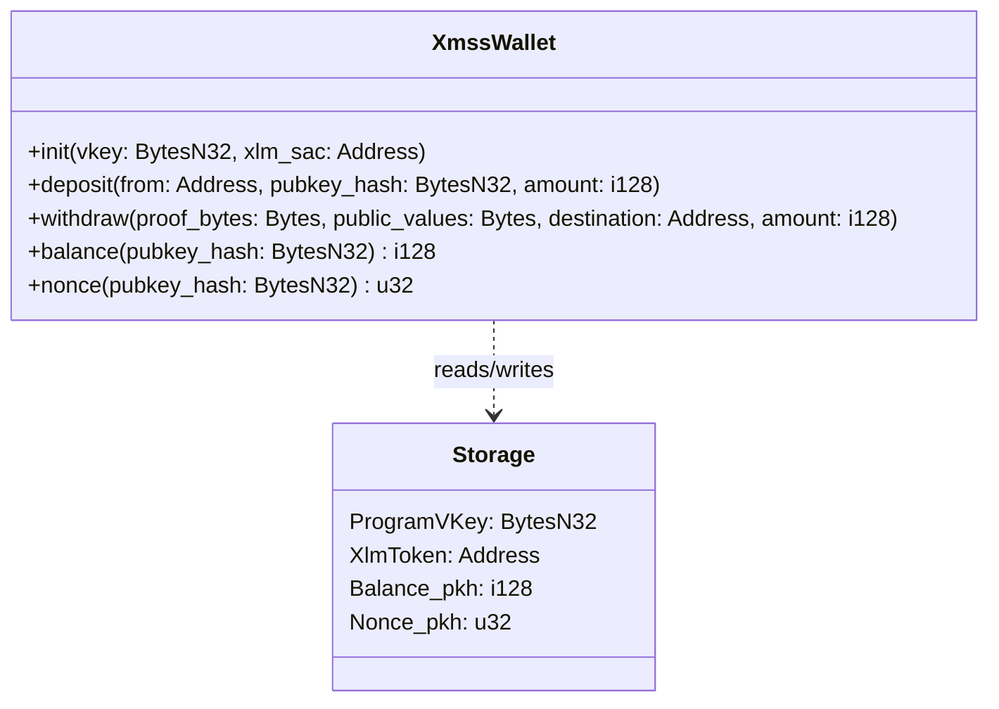

### 7.2 Storage Layout

| Key | Type | Lifetime | Description |
|-----|------|----------|-------------|
| `DataKey::ProgramVKey` | `BytesN<32>` | Instance | SP1 program verification key hash |
| `DataKey::XlmToken` | `Address` | Instance | XLM Stellar Asset Contract address |
| `DataKey::Balance(pk_hash)` | `i128` | Persistent | Balance in stroops (1 XLM = 10,000,000 stroops) |
| `DataKey::Nonce(pk_hash)` | `u32` | Persistent | Monotonically increasing replay counter |

### 7.3 Groth16 Verification (BN254)

The contract uses Soroban's native BN254 pairing host functions. The verification key is hardcoded from `sp1-contracts/v4.0.0-rc.3` byte arrays.

```
Pairing check (Groth16):
e(A, B) == e(alpha, beta) · e(vk_sum, gamma) · e(C, delta)

where:
  A, B, C     = proof points from proof_bytes
  alpha, beta = fixed VK elements (hardcoded)
  gamma, delta = fixed VK elements (hardcoded)
  vk_sum      = VK_IC[0] + pub_input_0·VK_IC[1] + pub_input_1·VK_IC[2]
  pub_inputs  = [program_vkey_hash, committed_values_digest]
```

### 7.4 tx_bytes Construction (108 bytes)

The contract's `build_tx_bytes` helper constructs the 108-byte transaction payload:

```
Offset  Size  Content
  0      32   contract_address encoded (XDR slice [4..36])
 32      32   pubkey_hash (sha256 of XMSS public key)
 64       4   wallet_nonce (u32 LE)
 68      32   destination_address encoded (XDR slice [4..36])
100       8   amount_stroops (i64 LE)
```

> The CLI must replicate this encoding exactly for `sha256(tx_bytes) == tx_hash` to match.

---

## 8. CLI Orchestration

### 8.1 Command Flow

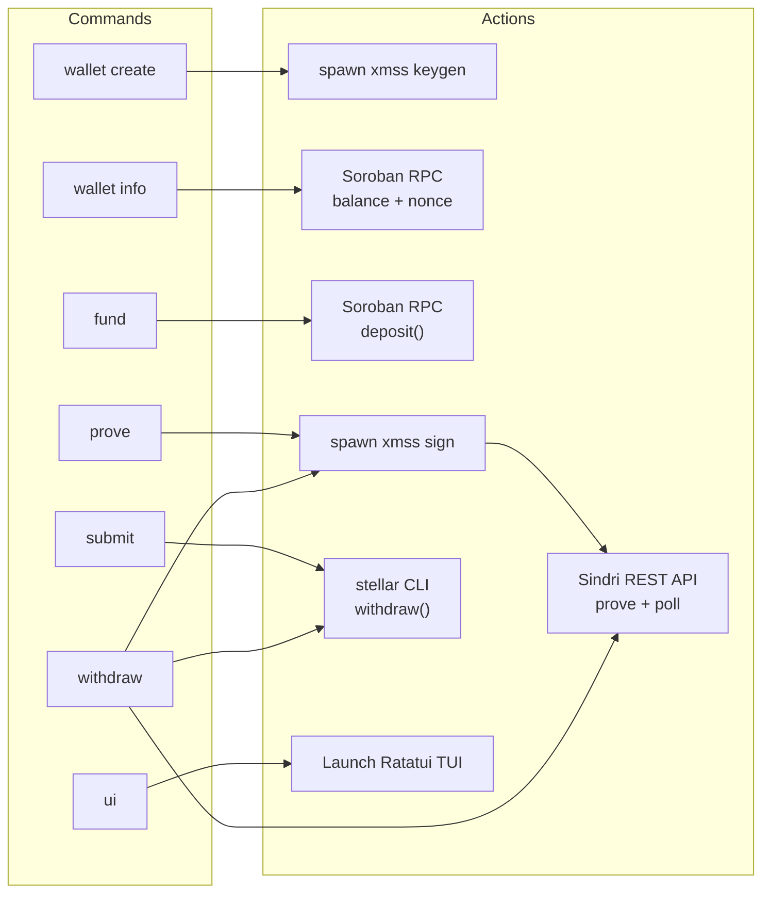

### 8.2 Environment Configuration (Baked into Binary)

| Variable | Description |
|----------|-------------|
| `WALLET_CONTRACT_ID` | Soroban contract address (`C...`) |
| `WALLET_CONTRACT_HASH` | 32-byte inner hash of contract (hex) |
| `SINDRI_API_KEY` | Sindri API key |
| `STELLAR_ACCOUNT` | Stellar account alias (default: `quantum-deployer`) |

### 8.3 Address Encoding

Stellar addresses must be encoded into `tx_bytes` exactly as the Soroban contract does via `address.to_xdr(env).slice(4..36)`:

| Address type | Encoding |
|-------------|----------|
| Contract (`C...`) | `[0,0,0,1]` (4B SC_ADDRESS discriminant) + `hash[0..28]` (28B) |
| Account (`G...`) | `[0,0,0,0,0,0,0,0]` (8B discriminants) + `key[0..24]` (24B) |

---

## 9. Browser Extension

### 9.1 Architecture

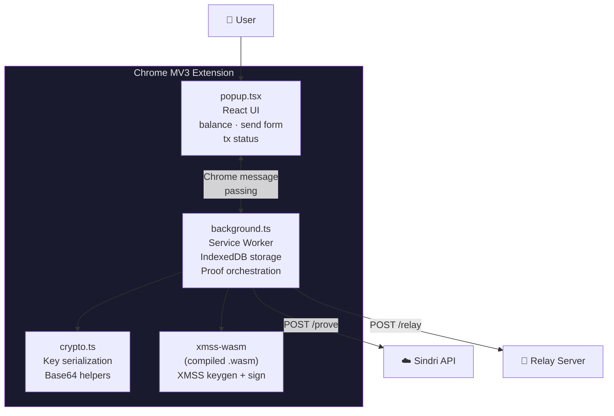

### 9.2 Key Storage

Keys are stored in **IndexedDB** inside the extension's service worker context. The XMSS key material (including `next_index`) is persisted across browser sessions.

### 9.3 WASM Integration

`xmss-wasm` compiles the XMSS Rust crate to WebAssembly using `wasm-pack`. The browser extension loads it via Vite's bundler. As of the latest toolchain, `getrandom 0.4` has native browser support, enabling direct WASM usage without additional polyfills.

---

## 10. Relay Server

### 10.1 Purpose & Architecture

Stellar's public testnet RPC (`horizon-testnet.stellar.org`) does **not** enable BN254 pairing host functions in simulation mode. The relay server works around this by invoking the `stellar` CLI locally, which runs the contract in a WASM VM with BN254 support enabled.

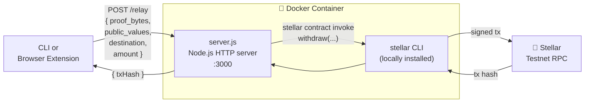

### 10.2 Relay Request Format

```json
{
  "proof_bytes": "<hex, 260 bytes>",
  "public_values": "<hex, 68 bytes>",
  "destination": "GDEST...ADDR",
  "amount_stroops": 100000000
}
```

---

## 11. Data Formats

### 11.1 key.json

```json
{
  "algorithm": "XMSS-SHA2_10_256",
  "public_key": "<hex, 68 bytes>",
  "secret_key": "<hex, large>",
  "next_index": 0
}
```

⚠️ `next_index` is incremented after every signing operation and written back immediately to prevent key reuse. Never modify this value manually — doing so can cause XMSS one-time keys to be reused, breaking the security guarantees of the signature scheme.

### 11.2 proof_inputs.json

```json
{
  "public_key": "<hex, 68 bytes>",
  "tx_bytes": "<hex, 108 bytes>",
  "signature": "<hex, 2500 bytes>",
  "leaf_index": 0,
  "nonce": 0
}
```

### 11.3 groth16_proof.json

```json
{
  "proof_bytes": "<hex, 260 bytes>",
  "public_values": "<hex, 68 bytes>"
}
```

### 11.4 public_values (68 bytes) layout

```
Offset  Size  Content
  0      32   pubkey_hash = sha256(XMSS public key)
 32      32   tx_hash     = sha256(tx_bytes)
 64       4   wallet_nonce = u32 LE
```

---

## 12. Security Properties

### 12.1 Post-Quantum Security

| Property | Achieved by |
|----------|------------|
| **Signing key** never exposed | XMSS private key stays in `key.json` on user's machine |
| **Quantum-resistant authentication** | XMSS relies only on SHA-256; not broken by Shor's or Grover's algorithms |
| **Signature non-forgery** | XMSS one-time keys: each leaf used at most once, Merkle tree binding |
| **ZK proof binding** | Groth16 proof commits to `pubkey_hash` and `tx_hash` — cannot reuse proof for different tx |

### 12.2 Replay Protection

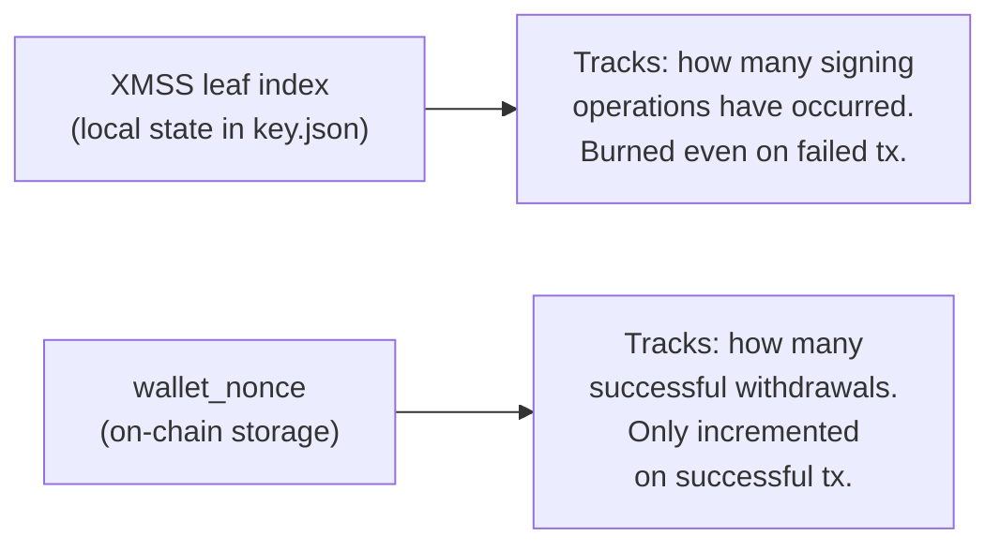

These two counters are **intentionally decoupled**. A failed on-chain transaction burns a WOTS+ leaf (advances `leaf_index`) but does **not** increment `wallet_nonce`. This means you can retry a failed transaction by re-signing with a new leaf — your balance is unaffected.

### 12.3 Proof Freshness

The `tx_hash = sha256(tx_bytes)` committed in the proof binds the proof to:
- A specific contract address
- A specific sender (`pubkey_hash`)
- A specific `wallet_nonce` (prevents replaying old proofs)
- A specific destination and amount

A proof generated for nonce `N` cannot be submitted when the on-chain nonce is `N+1`.

---

## 13. Design Decisions & Trade-offs

### 13.1 Why XMSS over SPHINCS+ or Falcon?

| Scheme | In-Circuit SHA-256 ops | Issues |
|--------|----------------------|--------|
| SPHINCS+ (FIPS 205) | ~17,000 | Prohibitively expensive in ZK |
| Falcon (FIPS 206) | Few | 32GB RAM for keygen; FFI cross-compilation failure |
| **XMSS (NIST SP 800-208)** | **~1,000–1,200** | **Stateful (1024 key limit) — acceptable for testnet** |

### 13.2 Why SP1 over Noir or Risc0?

| System | Decision | Reason |
|--------|----------|--------|
| Noir | Rejected | Couldn't implement custom XMSS circuit efficiently |
| Risc0 | Rejected (v1) | Used earlier; SP1 v4 offered better ecosystem + Sindri support |
| **SP1** | **Chosen** | Standard Rust code in zkVM; Sindri native support; active ecosystem |

### 13.3 Why Sindri over Self-Hosted Proving?

Generating a Groth16 proof for an SP1 RISC-V program requires significant computation (dozens of seconds on powerful hardware). Sindri provides a managed proving service with a REST API, making it accessible without specialized hardware. The trade-off: users need a Sindri API key.

### 13.4 Why a Relay Server?

Stellar's public testnet RPC disables BN254 pairing functions in `simulateTransaction`. The relay server runs a local Stellar CLI with a full node that supports BN254. This is a testnet-specific limitation and would not be required on mainnet.

### 13.5 Why Decouple XMSS leaf index from wallet nonce?

A naive design would use the XMSS leaf index as the on-chain replay counter. However, a failed transaction (e.g., network timeout, insufficient fee) would advance the leaf index but not be committed on-chain — making the wallet nonce out of sync. By embedding a separate `wallet_nonce` in `tx_bytes` (read from on-chain before signing), the system allows retrying with a new leaf without corrupting the replay counter.

---

<div align="center">

**See also:** [Non-Technical Guide](./docs/NON_TECHNICAL_GUIDE.md) · [Technical Reference](./docs/TECHNICAL_REFERENCE.md) · [Developer Guide](./docs/DEVELOPER_GUIDE.md) · [Dev Log](./DEVLOG.md)

</div>
