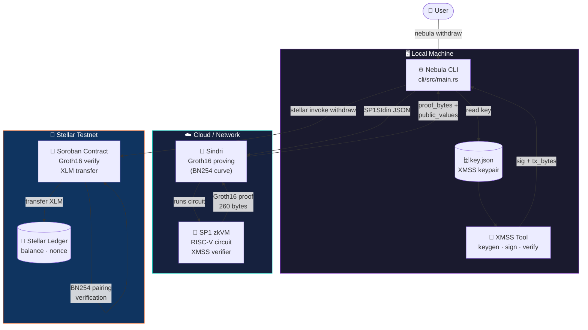
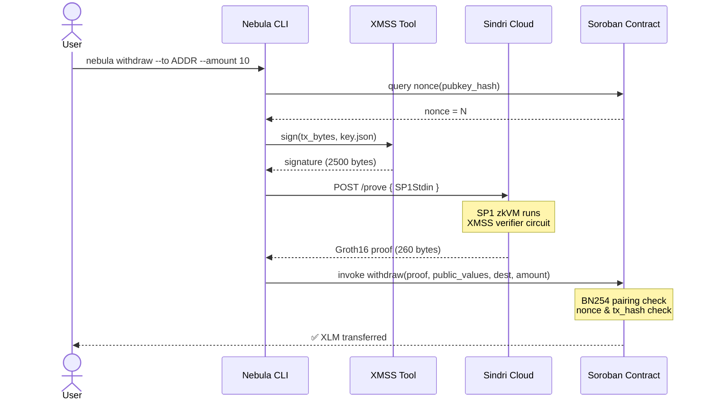

<div align="center">

# 🌌 Nebula

### The Post-Quantum Wallet for Stellar

**Send XLM using XMSS signatures verified on-chain via a ZK proof.**  
*No classical cryptography in the signing path. Quantum-resistant by design.*

[](https://stellar.org)
[](https://www.rust-lang.org)
[](https://succinct.xyz)
[](https://csrc.nist.gov/publications/detail/sp/800-208/final)
[]()


</div>

---

## ✨ What is Nebula?

Nebula is the world's first **post-quantum smart wallet on Stellar**. It replaces classical ECDSA signing (vulnerable to quantum computers) with **XMSS** — a hash-based, NIST-standardized signature scheme — and uses **zero-knowledge proofs** to verify signatures on-chain without ever exposing your key.

```
Your XMSS key  →  SP1 zkVM circuit  →  Groth16 proof (Sindri)  →  Soroban contract  →  XLM transfer
```

> 🔗 **Live contract on Stellar testnet:**  
> `CCQ4R5FTHPDBGPMYEWEDRKZMHWHYN4QB26DRTZCM4MICARWNLJK56Q6B`

---

## 🏗️ Architecture at a Glance



📖 **Want the full deep-dive?** See [`ARCHITECTURE.md`](./ARCHITECTURE.md)

---

## 📚 Documentation

| Audience | Document | Description |
|---|---|---|
| 🌱 **New Users** | [`docs/NON_TECHNICAL_GUIDE.md`](./docs/NON_TECHNICAL_GUIDE.md) | Plain-English guide — no crypto background needed |
| ⚙️ **Developers** | [`docs/TECHNICAL_REFERENCE.md`](./docs/TECHNICAL_REFERENCE.md) | Complete technical specification & data formats |
| 🔧 **Contributors** | [`docs/DEVELOPER_GUIDE.md`](./docs/DEVELOPER_GUIDE.md) | Build from source, testing, deployment |
| 🏛️ **Architects** | [`ARCHITECTURE.md`](./ARCHITECTURE.md) | System design, component diagrams, data flows |
| 📓 **History** | [`DEVLOG.md`](./DEVLOG.md) | Full engineering journal — every bug and decision |

---

## 🚀 Quick Start

### 1 · Install

**Linux / macOS — one line:**

```bash
curl -fsSL https://raw.githubusercontent.com/Eshan276/nebulav2/main/install.sh | bash
```

This downloads a pre-built binary for your platform (Linux x86\_64 · macOS ARM64 · macOS x86\_64) to `~/.local/bin`.

<details>
<summary>PATH setup (if needed)</summary>

Add to `~/.bashrc` or `~/.zshrc`:

```bash
export PATH="$HOME/.local/bin:$PATH"
```

Then reload:

```bash
source ~/.bashrc   # or ~/.zshrc
```

</details>

Verify:

```bash
nebula --help
```

> No `.env` file needed — all configuration is baked into the binary.

---

### 2 · Create a Wallet

```bash
nebula wallet create
```

Generates your XMSS keypair and saves it to `key.json`.

> ⚠️ **Back up `key.json` — losing it means losing access to your wallet.**

---

### 3 · Check Balance

```bash
nebula wallet info
```

---

### 4 · Fund Your Wallet

```bash
nebula fund --amount 100
```

Deposits 100 XLM from your standard Stellar account into your XMSS wallet contract.

---

### 5 · Send XLM

```bash
nebula withdraw --to GDEST...ADDR --amount 10
```

Signs locally with XMSS → generates ZK proof (~30–60 s) → submits on-chain. Done.

---

### 6 · Interactive Dashboard

```bash
nebula ui
```

Full terminal UI showing balance, nonce, XMSS keys remaining, and a send wizard.

---

## 🔬 How It Works



1. **XMSS signing** — Your private key signs the transaction locally. The key never leaves your machine.
2. **ZK proof generation** — SP1 runs an XMSS verifier circuit inside a RISC-V zkVM and compiles the result to a Groth16 proof via Sindri's cloud.
3. **On-chain verification** — The Soroban contract verifies the Groth16 proof using native BN254 pairing host functions, checks the nonce, and atomically transfers XLM.

> The contract never sees your private key or signature — only a mathematical proof that they existed.

---

## 🛡️ Why Post-Quantum?

| Scheme | Vulnerable to Quantum? | Used by |
|---|---|---|
| **ECDSA / ed25519** | ✅ Yes (Shor's algorithm) | Bitcoin, Ethereum, Stellar (native) |
| **XMSS** | ❌ No (hash-based) | **Nebula** |

XMSS (NIST SP 800-208 / RFC 8391) uses only hash functions internally. Quantum computers cannot break hash functions efficiently. Your funds remain secure even against a quantum adversary.

### XMSS Key Limits

`XMSS-SHA2_10_256` provides **1,024 one-time signing keys** per wallet. Each withdrawal consumes one leaf. The `nebula ui` dashboard shows how many remain. When exhausted, generate a new wallet and migrate funds with a standard withdrawal.

---

## 🔒 Security Notes

| Concern | Detail |
|---|---|
| **Key storage** | `key.json` is your XMSS private key. Never commit it to version control or upload it unencrypted. |
| **Failed transactions** | A failed tx burns one XMSS leaf but does **not** increment the on-chain nonce. Your balance is unaffected; you can retry. |
| **Proof generation** | Sindri runs the circuit in a sandboxed environment. Your private key and raw signature never leave your device. |
| **Quantum resistance** | All on-chain verification relies on SHA-256 hash operations, which are not broken by known quantum algorithms. |

---

## 🧱 Tech Stack

| Component | Technology | Purpose |
|---|---|---|
| **Signature scheme** | XMSS-SHA2_10_256 (NIST SP 800-208) | Post-quantum signing |
| **ZK circuit** | SP1 zkVM (Succinct Labs) | XMSS verification in RISC-V zkVM |
| **ZK proof format** | Groth16 on BN254 (via Sindri) | Compact 260-byte on-chain proof |
| **Smart contract** | Soroban (Stellar) | On-chain proof verification + XLM transfer |
| **CLI** | Rust + Clap + Ratatui | Command-line interface & TUI |
| **Browser extension** | Chrome MV3 · React · TypeScript · Vite | Web UI for casual users |
| **Relay server** | Node.js · Docker | Bypasses Stellar RPC BN254 simulation limit |
| **Network** | Stellar testnet | Live deployment target |

---

## 📂 Repository Structure

```
nebulav2/
├── cli/          # Rust CLI binary (nebula command) + TUI
├── sp1/          # SP1 zkVM circuit — XMSS-SHA2_10_256 verifier
├── soroban/      # Soroban smart contract — Groth16 verifier + XLM transfer
├── xmss/         # XMSS keygen + signing tool
├── xmss-wasm/    # XMSS compiled to WebAssembly (browser extension)
├── extension/    # Chrome MV3 browser extension (React + TypeScript)
├── relayer/      # Node.js relay server (Docker)
├── docs/         # 📚 Documentation for all audiences
├── ARCHITECTURE.md
├── DEVLOG.md
└── install.sh
```

---

<div align="center">

**Built with ❤️ for a quantum-safe future**

[Architecture](./ARCHITECTURE.md) · [Non-Technical Guide](./docs/NON_TECHNICAL_GUIDE.md) · [Technical Reference](./docs/TECHNICAL_REFERENCE.md) · [Developer Guide](./docs/DEVELOPER_GUIDE.md) · [Dev Log](./DEVLOG.md)

</div>
